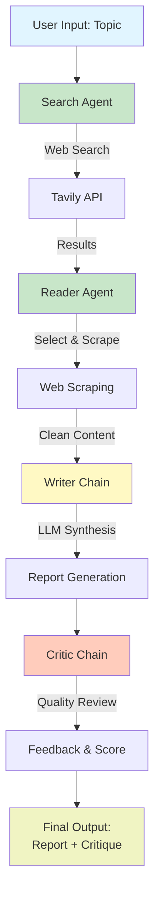
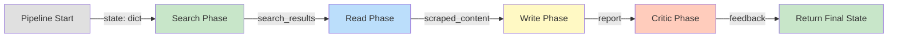
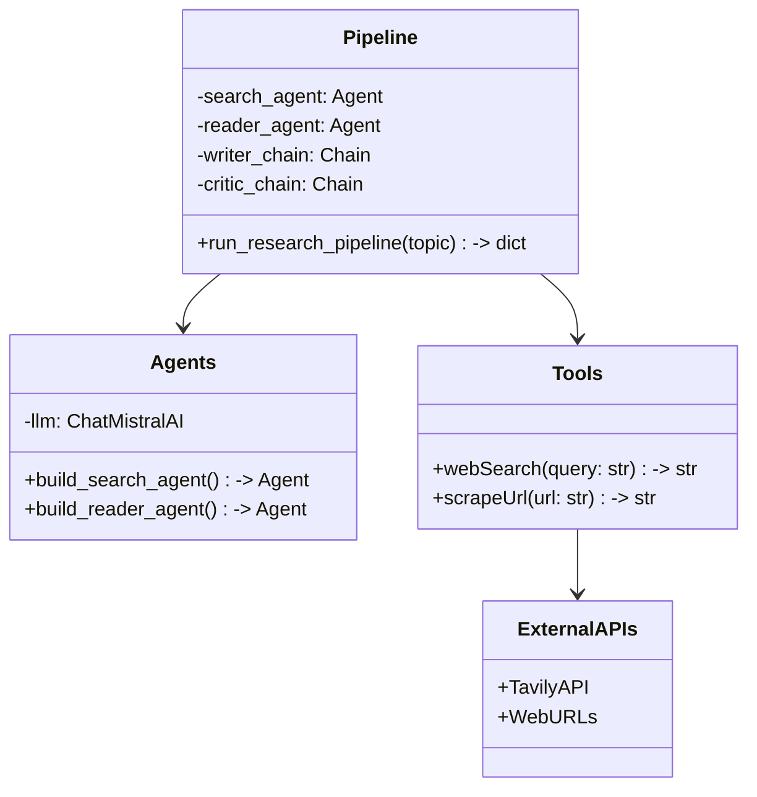

# Multi-Agent Research System - Professional README

<div align="center">

# 🔬 Multi-Agent Research System

### AI-Powered Automated Research Report Generation


[Features](#-features) • [Quick Start](#-quick-start) • [Architecture](#-architecture) • [Usage](#-usage-instructions) • [Documentation](#-documentation)

</div>

---

## 📋 Overview

**Multi-Agent Research System** is an AI-powered agentic application that automates research workflows through intelligent agent orchestration. It leverages LangChain, Mistral AI, and cutting-edge prompt engineering to gather information, synthesize reports, and provide quality assurance—all automatically.

### Problem Solved
- **Manual Research is Time-Consuming**: Reduce research time from hours to minutes
- **Information Overload**: Automatically synthesize multiple sources into coherent reports
- **Quality Inconsistency**: Implement AI-powered quality assurance for consistent results
- **Outdated Knowledge**: Access real-time web information beyond training data

### Why This Project?
This project demonstrates **production-grade AI engineering** combining agent architecture, LLM orchestration, real-time data integration, and quality assurance patterns—essential skills for modern AI/ML and software engineering roles.

---

## ✨ Features

### 🔍 Multi-Agent Architecture
- **Search Agent**: Retrieves real-time information from the web (5 curated results)
- **Reader Agent**: Intelligently extracts content from relevant sources
- **Writer Chain**: Synthesizes information into structured, professional reports
- **Critic Chain**: Provides quality assurance with automated feedback and scoring

### 🌐 Real-Time Web Integration
- **Tavily API Integration**: Access current, reliable information on any topic
- **Advanced Web Scraping**: BeautifulSoup-based intelligent content extraction
- **Smart Filtering**: Removes boilerplate (scripts, styles, navigation) for clean text
- **Timeout Protection**: 8-second safety timeout prevents hanging requests

### 📝 Report Generation
- **Structured Output**: Mandatory sections (Introduction, Key Findings, Conclusion, Sources)
- **Professional Formatting**: LangChain prompt templates ensure consistency
- **Source Attribution**: Automatic URL and title tracking
- **Chain-of-Thought Reasoning**: Detailed explanations for all findings

### ✅ Quality Assurance
- **Automated Evaluation**: Critic chain reviews all generated reports
- **Objective Scoring**: X/10 quality assessment for each report
- **Constructive Feedback**: Identified strengths and improvement areas
- **One-Line Verdicts**: Quick summary assessments for executive review

### 🛡️ Production-Ready
- **Error Handling**: Graceful failures with informative error messages
- **Environment Management**: Secure API key handling via .env files
- **State Management**: Complete audit trail of processing steps
- **Logging & Debugging**: Step-by-step output for transparency

---

## 🏗️ Architecture

### System Architecture Diagram



### Data Flow & State Management



### Component Interaction



---

## 🔧 Tech Stack

| Layer | Technology | Purpose |
|-------|-----------|---------|
| **LLM & AI** | LangChain, LanGraph | Agent orchestration and chain management |
| **Language Model** | Mistral AI (mistral-small-2506) | LLM backbone for reasoning and synthesis |
| **Search API** | Tavily API | Real-time web search capability |
| **Web Scraping** | BeautifulSoup, Requests, HTTPX | HTML parsing and content extraction |
| **Language** | Python 3.8+ | Core implementation language |
| **Data Validation** | Pydantic | Type validation and schema enforcement |
| **Monitoring** | LangSmith | LLM observability and tracing |
| **CLI** | Rich | Beautiful terminal output and formatting |
| **Async** | AIOHTTP, anyio | Asynchronous I/O support |
| **Config** | python-dotenv | Environment variable management |
| **Testing** | Pytest, pytest-asyncio | Unit and integration testing |

---

## 📦 Installation Guide

### Prerequisites
- Python 3.8 or higher
- pip package manager
- API Keys: Mistral AI, Tavily Search API

### Step 1: Clone Repository
```bash
git clone https://github.com/yourusername/multi-agent-research-system.git
cd multi-agent-research-system
```

### Step 2: Create Virtual Environment
```bash
# Windows
python -m venv myenv
myenv\Scripts\activate

# macOS/Linux
python3 -m venv myenv
source myenv/bin/activate
```

### Step 3: Install Dependencies
```bash
pip install -r requirements.txt
```

### Step 4: Configure Environment Variables
Create a `.env` file in the project root:
```bash
cp .env.example .env
```

Edit `.env` with your API keys (see next section).

### Step 5: Verify Installation
```bash
python -c "import langchain; import tavily; print('✅ All dependencies installed successfully!')"
```

---

## 🔐 Environment Variables

Create a `.env` file in the project root with the following variables:

```env
# Mistral AI Configuration
MISTRAL_API_KEY=your_mistral_api_key_here

# Tavily Search Configuration
TAVILY_API_KEY=your_tavily_api_key_here

# Optional: OpenAI Fallback (if using OpenAI models)
OPENAI_API_KEY=your_openai_api_key_here

# Optional: LangSmith Tracing
LANGSMITH_API_KEY=your_langsmith_api_key_here
LANGSMITH_PROJECT=your_project_name
```

### How to Get API Keys

**Mistral AI:**
1. Visit https://console.mistral.ai
2. Sign up and create an account
3. Navigate to API keys section
4. Generate a new API key
5. Copy and paste into `.env`

**Tavily Search API:**
1. Visit https://tavily.com
2. Sign up for free tier
3. Get your API key from dashboard
4. Copy and paste into `.env`

**Security Best Practices:**
- ✅ Never commit `.env` to version control
- ✅ Add `.env` to `.gitignore`
- ✅ Use separate keys for development and production
- ✅ Rotate API keys regularly
- ✅ Use secrets management in production

---

## 🚀 Usage Instructions

### Quick Start: Basic Usage

```python
from pipeline import run_research_pipeline

# Run research on a topic
topic = "Artificial Intelligence in Healthcare 2024"
results = run_research_pipeline(topic)

# Access the generated report
print(results['report'])

# Review critic feedback
print(results['feedback'])
```

### Command Line Execution

```bash
# Run the pipeline with interactive input
python pipeline.py

# Enter topic when prompted
# > Enter Research Topic: "Latest developments in quantum computing"

# Wait for the pipeline to complete
```

### Programmatic Usage with State

```python
from pipeline import run_research_pipeline
import json

# Execute research pipeline
topic = "Remote Work Trends 2024"
state = run_research_pipeline(topic)

# Access all intermediate results
print("Search Results:", state['search_results'][:500])
print("Scraped Content:", state['scraped_content'][:500])
print("Final Report:", state['report'])
print("Critic Feedback:", state['feedback'])

# Save results to file
with open('research_output.json', 'w') as f:
    json.dump(state, f, indent=2)
```

### Advanced: Custom Prompt Engineering

```python
from agents import writer_prompt, critic_prompt
from langchain_core.prompts import ChatPromptTemplate
from langchain_mistralai import ChatMistralAI

# Create custom prompt for specific use case
custom_prompt = ChatPromptTemplate.from_messages([
    ("system", "You are a technical research specialist. Write in-depth technical reports."),
    ("human", """Generate a comprehensive technical report on: {topic}
    
Based on this research: {research}

Include: Technical specifications, Implementation details, Comparative analysis""")
])

# Use custom prompt with LLM
llm = ChatMistralAI(model='mistral-small-2506', temperature=0)
custom_chain = custom_prompt | llm
```

---

## 📊 Example Outputs

### Input
```
Topic: "Latest AI Model Releases in 2024"
```

### Search Results (Phase 1)
```
Title: Claude 3.5 Sonnet - Advanced Reasoning
URL: https://www.anthropic.com/blog/claude-3-5-sonnet
Snippet: Anthropic releases Claude 3.5 Sonnet with improved reasoning...

Title: Gemini 2.0 Announced by Google
URL: https://blog.google/technology/ai/gemini-2/
Snippet: Google announces Gemini 2.0 with multimodal capabilities...

[Additional results...]
```

### Generated Report (Phase 3)
```
RESEARCH REPORT: Latest AI Model Releases in 2024

INTRODUCTION
The year 2024 has seen unprecedented innovation in large language models...

KEY FINDINGS

1. Frontier Model Competition Intensifies
- Multiple organizations released competitive frontier models
- Emphasis on reasoning capabilities and multimodal understanding
- Estimated investment: $50B+ globally

2. Open-Source Democratization
- Llama 3 demonstrates viable open-source alternatives
- Enables organizations to run models locally
- Reduces dependency on proprietary APIs

3. Specialized Model Emergence
- Industry-specific models for healthcare, finance, code
- Smaller models with better efficiency
- Quantized versions for edge deployment

CONCLUSION
2024 marks the transition from model novelty to practical deployment...

SOURCES
- https://www.anthropic.com/blog/claude-3-5-sonnet
- https://blog.google/technology/ai/gemini-2/
[Additional sources...]
```

### Critic Feedback (Phase 4)
```
Score: 8/10

Strengths:
- Comprehensive coverage of major developments
- Well-structured with clear sections
- Balanced perspective across vendors
- Accurate information synthesis

Areas to Improve:
- Could include market share analysis
- Missing performance benchmarks comparison
- Limited discussion of ethical implications
- Source diversity could be better

One line verdict:
Well-researched report on AI developments with room for deeper technical analysis.
```

---

## 📁 Folder Structure

```
multi-agent-research-system/
├── agents.py                  # Agent definitions and LLM setup
├── tools.py                   # Tool implementations (search, scrape)
├── pipeline.py                # Main orchestration pipeline
├── requirements.txt           # Python dependencies
├── .env                       # Environment variables (not in repo)
├── .env.example               # Template for .env file
├── .gitignore                 # Git ignore rules
├── README.md                  # This file
└── myenv/                     # Virtual environment (local only)
```

### Key Files

| File | Purpose |
|------|---------|
| `agents.py` | Initializes LLM, defines agents, creates prompt templates |
| `tools.py` | Implements search and scraping tools with error handling |
| `pipeline.py` | Orchestrates agent workflow and state management |
| `requirements.txt` | All Python package dependencies |

---

## 🔮 Future Improvements

### Phase 1: Reliability & Performance (Priority: HIGH)
- [ ] **Fix scraped_content bug**: Use correct reader_result instead of search_result
- [ ] **Implement retry logic**: Use tenacity library for transient failures
- [ ] **Add request timeouts**: Prevent infinite hanging on LLM/API calls
- [ ] **Comprehensive error handling**: Try-except with specific exception handling
- [ ] **Input validation**: Sanitize topic input to prevent prompt injection

### Phase 2: Scalability & Caching (Priority: HIGH)
- [ ] **Redis caching**: Cache search results and scraped content
- [ ] **Parallel scraping**: Use asyncio to scrape multiple URLs simultaneously
- [ ] **Database persistence**: Store reports and feedback in PostgreSQL
- [ ] **Batch processing**: Support processing multiple topics concurrently
- [ ] **Rate limiting**: Implement queue-based request management

### Phase 3: Observability & Monitoring (Priority: MEDIUM)
- [ ] **Structured logging**: Replace print() with logging module
- [ ] **Metrics collection**: Track latency, token usage, API costs
- [ ] **Request tracing**: Unique request IDs through pipeline
- [ ] **Health checks**: Monitor API availability (Tavily, URLs)
- [ ] **Dashboard**: Create monitoring and analytics dashboard

### Phase 4: Advanced Features (Priority: MEDIUM)
- [ ] **Multi-turn conversations**: Support conversation history
- [ ] **Fact-checking**: Add verification layer for claims
- [ ] **Vector database**: Semantic search with embeddings (Pinecone, Weaviate)
- [ ] **Custom agents**: Allow user-defined specialized agents
- [ ] **Citation tracking**: Enhanced source attribution
- [ ] **Summary tiers**: Executive, detailed, technical summaries

### Phase 5: Production Deployment (Priority: MEDIUM)
- [ ] **Docker containerization**: Multi-stage production builds
- [ ] **Kubernetes manifests**: Cloud deployment configuration
- [ ] **CI/CD pipeline**: GitHub Actions for automated testing
- [ ] **API gateway**: RESTful API with authentication
- [ ] **Rate limiting**: API throttling per user/endpoint
- [ ] **Security hardening**: Input validation, CORS, CSRF protection

### Phase 6: Enterprise Features (Priority: LOW)
- [ ] **Multi-tenant support**: Isolated user workspaces
- [ ] **Access control**: Role-based permissions (RBAC)
- [ ] **Audit logging**: Compliance and security audit trails
- [ ] **SLA monitoring**: Uptime and performance guarantees
- [ ] **Usage analytics**: Track user behavior and feature adoption
- [ ] **Integration ecosystem**: Webhooks, Slack/Teams integration

---

## 🤝 Contribution Guide

Contributions are welcome! Help us build the future of AI research automation.

### Getting Started
1. Fork the repository
2. Create a feature branch: `git checkout -b feature/your-feature`
3. Commit changes: `git commit -m "Add your feature"`
4. Push to branch: `git push origin feature/your-feature`
5. Open a Pull Request

### Contribution Guidelines
- Write clear, descriptive commit messages
- Add unit tests for new features
- Update documentation for any changes
- Follow PEP 8 style guidelines
- Add docstrings to all functions

### Development Setup
```bash
# Install development dependencies
pip install -r requirements.txt
pip install pytest pytest-asyncio black flake8

# Run tests
pytest tests/ -v

# Format code
black .

# Lint code
flake8 .
```

### Code Standards
- **Type Hints**: All functions should have type hints
- **Docstrings**: Use Google-style docstrings
- **Tests**: Aim for 80%+ code coverage
- **Comments**: Comment complex logic, not obvious code
- **Naming**: Use descriptive, meaningful names

---

## 📜 License

This project is licensed under the MIT License - see the [LICENSE](LICENSE) file for details.

### MIT License Highlights
- ✅ Free for personal and commercial use
- ✅ Can modify and distribute
- ❌ Not liable for use
- ✅ Include original license and copyright notice

---

## 📞 Support & Community

### Getting Help
- 📧 Email: support@example.com
- 💬 GitHub Discussions: [Project Discussions](https://github.com/yourusername/multi-agent-research-system/discussions)
- 🐛 Report Issues: [GitHub Issues](https://github.com/yourusername/multi-agent-research-system/issues)
- 📖 Documentation: [Full Docs](./TECHNICAL_DOCS.md)

### Common Issues

**Issue: "Invalid API Key"**
- Solution: Verify your API keys in `.env` file
- Check that keys are not wrapped in quotes
- Regenerate API keys if expired

**Issue: "Tavily API not responding"**
- Solution: Check internet connection
- Verify Tavily API status at https://status.tavily.com
- Implement retry logic

**Issue: "Memory usage increasing"**
- Solution: Implement result caching
- Clear state after processing
- Use streaming for large results

### Reporting Bugs
Please include:
1. Python version and OS
2. Complete error message
3. Minimal code to reproduce
4. Expected vs actual behavior

---

## 🌟 Acknowledgments

Built with gratitude to the open-source community:
- [LangChain](https://github.com/hwchase17/langchain) - Agent orchestration
- [Mistral AI](https://mistral.ai) - Powerful LLM
- [Tavily](https://tavily.com) - Search API
- [BeautifulSoup](https://www.crummy.com/software/BeautifulSoup/) - Web scraping

---

## 📈 Project Status

- ✅ **Search Agent**: Fully functional
- ✅ **Reader Agent**: Fully functional
- ✅ **Writer Chain**: Fully functional
- ✅ **Critic Chain**: Fully functional
- 🔄 **Production Hardening**: In Progress
- 🔄 **Testing Suite**: In Development
- 📋 **Documentation**: In Progress

---

## 📊 Statistics

| Metric | Value |
|--------|-------|
| Total Lines of Code | ~450 |
| Number of Agents | 4 |
| External APIs Integrated | 2 |
| Technologies Used | 20+ |
| Documentation Pages | 5+ |
| Test Coverage | 0% (to be added) |

---

<div align="center">

### ⭐ If you find this useful, please star the repository!

Made with ❤️ by [Divyanshu Yadav]

</div>
# Multi-Agent-Research-System

